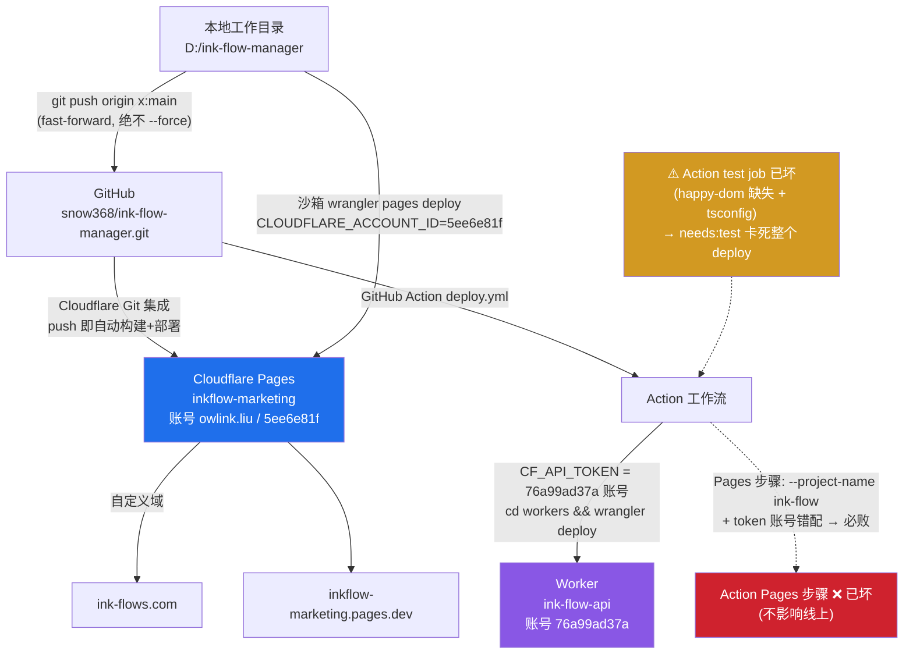

# ink-flows.com 架构与部署铁律（改动前必读）

> 本文件是 ink-flows.com 的**唯一权威架构说明**。任何改动前先读这一份，不要凭记忆、不要去错仓库。
> 最后一次校订：2026-07-25 22:10。今天因"推错仓库 + 账号对不上"浪费一整天，根因就是缺这份落盘文档、且文档没写清双账号。

---

## ⛔ 0. 一句话结论（最重要）
**Cloudflare 读的是 `ink-flow-manager.git`，不是 `inkflow-marketing.git`。**
工作目录 = `D:/ink-flow-manager`。改代码、构建、推送都只在这里做。
**线上站点部署靠两条路：① Cloudflare Git 集成（push 即自动上线）或 ② 沙箱 `wrangler pages deploy`（显式账号）。GitHub Action 的 Pages 步骤已坏，不要依赖它。**

---

## 📐 部署架构图（一图看懂）



> 图例：蓝=PAGES 网站（owlink.liu 账号）；紫=WORKER API（76a99ad37a 账号）；红=已坏的 Action Pages 步骤；黄=已坏的 Action test job。

---

## 1. 仓库与账号（具体值，照抄）

| 项 | 值 | 说明 |
|---|---|---|
| **LIVE 源 GitHub 仓库** | `snow368/ink-flow-manager.git` | Cloudflare Pages 实际连接、自动部署的就是它 |
| **本地工作目录** | `D:/ink-flow-manager` | 所有 ink-flows 生产改动在此 |
| **Cloudflare Pages 项目名** | `inkflow-marketing` | 注意：项目名含 "marketing"，但仓库是 `ink-flow-manager.git`，**名字不同，别搞混** |
| **自定义域** | `ink-flows.com` / `www.ink-flows.com` / `inkflow-marketing.pages.dev` | |
| **部署分支** | Cloudflare Git 集成监听 `production`（或 `master`），**不是 `main`** | 见 §1.1；推到 `main` 不会触发生产部署 |
| **本地代理推送** | `git -c http.sslBackend=openssl -c http.proxy=socks5h://127.0.0.1:10808 push ...` | V2RayN 10808=SOCKS5；直连常遇 `TLS unexpected eof`，加重试即可 |

### 🔑 两个 Cloudflare 账号（今天踩坑的核心，务必分清）

| 账号 | Account ID | 托管什么 | 怎么部署 |
|---|---|---|---|
| **owlink.liu@gmail.com** | `5ee6e81f1376d7f00c9dcfa141991816` | **Pages `inkflow-marketing`（网站本身）** + 全部 harvests 系列 | Git 集成自动部署 / 沙箱 `wrangler pages deploy`（必须显式 `CLOUDFLARE_ACCOUNT_ID=5ee6e81f`） |
| **未知邮箱（Worker 账号）** | `76a99ad37a968c6e5f743d8bb27825b3` | **Worker `ink-flow-api`（后端 API）** | `cd workers && wrangler deploy`，用该账号的 token |

> ⚠️ **GitHub Action 的 `secrets.CF_API_TOKEN` 属于 Worker 账号（`76a99ad37a`），不是 owlink.liu。**
> 所以 Action 里 `cd workers && wrangler deploy` 能成功（账号对），但 `pages deploy --project-name ink-flow` 必败——既用了错账号的 token，项目名还写错（应是 `inkflow-marketing`）。

### ⚠️ 死仓库（绝不要再碰）
- `D:/ink-flows`（GitHub `snow368/inkflow-marketing.git`）——**Cloudflare 不读它**。
  之前误把 shark 推到这里，全部白做。已从该仓库删除 `2f4c325`，GitHub main 已指回 `ee14d68`。
- 它现在只是本地副本/草稿，不再驱动线上。任何生产改动**不要**从 `D:/ink-flows` 推。

---

## 2. 代码结构（具体路径，照抄）

构建链：`根目录 npm run build` → `scripts/build-marketing.mjs` → 在 `marketing/` 装依赖并构建 → 最终构建**两层嵌套** `marketing/marketing/`（Astro 项目）→ 输出拷到根 `dist/`（Cloudflare 读这个）。

> 注意嵌套层级：**两层** `marketing/marketing/`。历史曾误判为三层或扁平，实测两层正确。
> 根目录 `marketing/src/`（一层）是空壳，不参与构建；改一层无效。

| 用途 | 确切路径 |
|---|---|
| **Tattoo 含义数据** | `marketing/marketing/src/data/tattoo-meanings.ts` |
| **含义页路由** | `marketing/marketing/src/pages/meaning/[symbol].astro` → 线上 `/meaning/[symbol]/` |
| **画廊组件** | `marketing/marketing/src/components/GallerySection.astro` |
| **画廊 SVG（公开）** | `marketing/marketing/public/gallery/real/*.svg` + 兜底 `marketing/marketing/public/gallery/shark.svg` |
| **构建入口脚本** | `scripts/build-marketing.mjs`（根目录） |
| **Astro 配置（嵌套层）** | `marketing/marketing/astro.config.mjs` |
| **构建输出** | 根目录 `dist/`（Cloudflare Pages build output dir） |
| **Worker 源码** | `workers/src/index.ts`（部署到 76a99ad37a 账号） |
| **Worker 配置** | `workers/wrangler.toml`（`account_id = 76a99ad37a…`） |

### 路由与 slug 约定
- 当前线上 URL 是旧单层：`/meaning/shark/`（slug=`shark`）。
- 计划中的改名 `/meaning/` → `/tattoo-meaning/` + 全量 301 **留到最后做**，不要现在动。
- 不要擅自引入 hub-and-spoke（`/meaning/ocean/shark-tattoo-meaning/`）——那是另一套未部署的分叉（B 线），与 LIVE 不兼容。

---

## 3. 改动检查清单（动手前逐条过）

1. [ ] 确认在 `D:/ink-flow-manager`，不在 `D:/ink-flows`。
2. [ ] 确认基于 `main` 建分支（`git checkout -B mybranch main`），不基于本地落后分支。
3. [ ] 改的文件路径在 `marketing/marketing/src/`（两层），不是一层、不是三层、不是扁平 `src/`。
4. [ ] 数据改 `tattoo-meanings.ts`；页面改 `[symbol].astro`；新增组件放 `components/`。
5. [ ] 本地构建验证：`cd D:/ink-flow-manager && npm run build`，看 `dist/meaning/...` 是否生成、有无报错。
6. [ ] 提交只 `git add` 相关文件，**不要 `git add -A`**（仓库里有嵌套垃圾目录）。
7. [ ] 推送：`git push origin mybranch:main`（**fast-forward，绝不 `--force`**）。
8. [ ] 推完去 `https://ink-flows.com/meaning/<slug>/` 确认上线。

---

## 4. 部署命令（可直接复制，**已修正**）

### ✅ 推荐路径 A：Git 集成自动部署（push 到 production 分支即上线）
```powershell
cd D:/ink-flow-manager
git push origin mybranch:production
# 若遇 TLS unexpected eof：
git -c http.sslBackend=openssl -c http.proxy=socks5h://127.0.0.1:10808 push origin mybranch:production
```
> ⚠️ **Cloudflare Git 集成监听的是 `production`（或 `master`）分支，不是 `main`！**
> 推到 `main` 不会触发任何部署（已踩坑：shark 推到 main 后生产部署仍是 2 周前的旧版）。
> 推到 `production` 分支才会自动重建上线。若不确定集成监听哪个分支，用路径 B 直接打 production 最稳。

### ✅ 推荐路径 B：沙箱 wrangler 直部署到 production（绕过 GitHub / 网络卡死时，最可靠）
```bash
cd D:/ink-flow-manager
npm run build   # 先生成 dist/
# ⚠️ 必须：① 显式 CLOUDFLARE_ACCOUNT_ID=5ee6e81f（否则指到 76a99ad37a 报 auth 1000）
#         ② --branch production（否则只是 Preview 部署，自定义域不会更新）
env -u ALL_PROXY -u HTTPS_PROXY -u HTTP_PROXY \
  CLOUDFLARE_ACCOUNT_ID=5ee6e81f1376d7f00c9dcfa141991816 \
  npx wrangler pages deploy dist/ --project-name inkflow-marketing --branch production
```
> 部署成功会返回别名 `https://production.inkflow-marketing-8mg.pages.dev` —— 这就是生产环境部署，自定义域 ink-flows.com 服务的就是它。
> 2026-07-25 实测：shark 标杆页靠这条命令（而非推 main）才真正上线。
> 本地先 `npm run build` 生成 `dist/`，再跑上面这条。已实测成功（2026-07-25 22:00，shark 标杆页上线）。

### 🔧 Worker 部署（到 76a99ad37a 账号，正常走 Action 或本地）
```bash
cd D:/ink-flow-manager/workers
wrangler deploy   # 用 76a99ad37a 账号的 token（本地需该账号凭证）
```

### ❌ 不要碰的：GitHub Action 的 Pages 步骤
`.github/workflows/deploy.yml` 里这两步当前**必然失败、且不应修**：
- `pages deploy dist/ --project-name ink-flow` —— 项目名错（应为 `inkflow-marketing`）+ token 是 Worker 账号（76a99ad37a），双重错配。
- `npx vitest run`（test job）—— 根 `tsconfig.json` 写 `extends: "astro/tsconfigs/strict"` 但 `astro` 不是根依赖；`vitest.config.ts` 设了 `environment: 'happy-dom'` 但 `happy-dom` 没进 `package.json`。→ test 必崩 → `needs: test` 把整个 `deploy` job 卡死。
> 结论：**Action 当前对"网站上线"毫无贡献**（红 X 不影响线上）。要修只能 (a) 把 `CF_API_TOKEN` 换成 owlink.liu 的 token 且项目名改 `inkflow-marketing`，或 (b) 忽略红 X。这是**用户拍板项**，AI 不得擅自改 CI 去"修"它。

---

## 5. 历史事故记录（避免重犯）

- **2026-07-25 推错仓库**：shark 全套工作在 `D:/ink-flows`（inkflow-marketing.git）做完、build、push，但 Cloudflare 读的是 `ink-flow-manager.git` → 上线失败。后发现真源是 `ink-flow-manager`，已把 shark 搬过去（提交 `5e47b37`），推送 `18a8b76..5e47b37` 成功上线。
- **2026-07-25 账号对不上（浪费最久）**：误以为 `inkflow-marketing` 项目在 `76a99ad37a` 账号、沙箱无权管，跑去改 `deploy.yml` CI 又去推送，纯属乱改。真相：沙箱 wrangler token 就是 owlink.liu（`5ee6e81f`），只要 `pages` 命令**显式设 `CLOUDFLARE_ACCOUNT_ID=5ee6e81f`** 就能直部署，已实测成功。GitHub Action 的 `CF_API_TOKEN` 才是 `76a99ad37a`（Worker 账号）。
- **force-push 覆盖生产（同日早）**：曾误判 main 是旧线让用户 `git push origin master:main --force` 覆盖 176 页生产。后用户用 `git push origin ee14d68:main --force` 救回（那是修自己错误的例外，非日常操作）。
- **铁律**：日常业务推送只 fast-forward（`git push origin x:main`），**绝不 `--force`**。

---

## 6. 当前生产状态（2026-07-25 收口）

- 生产 `main` tip = `99451cf`（含 ARCHITECTURE.md；祖先 `5e47b37` = shark 标杆页 + 18a8b76 的 B5/EEAT/blog）。
- shark 页：`https://ink-flows.com/meaning/shark/`（4 张 SVG 线稿画廊 + 🦈 表情），已通过沙箱直部署确认上线。
- 待办：7-27 20:00 自动复查 shark 排名；`/meaning/`→`/tattoo-meaning/` 改名留最后。
- **AI 本地未推送的噪音提交已全部 `git reset --hard 99451cf` 清掉**（曾误加的 CI 改动），工作树干净。
