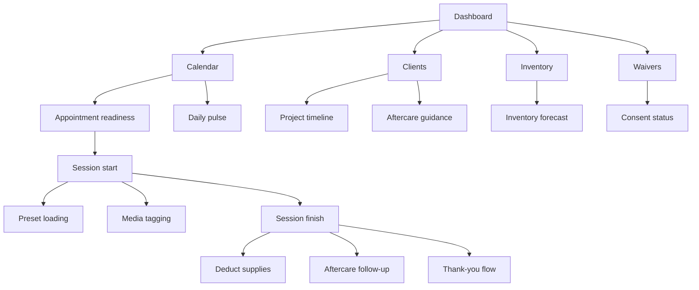

# Ink Flow Manager Flow Audit

## Current line map

## What is now reasonable

- The app covers the core studio surfaces: schedule, clients, inventory, waivers, and financial overview.
- Appointments now have an explicit readiness classification before session start, instead of relying only on the stored status text.
- Inventory forecasting now uses date-normalized filtering and item-sensitive factors, so "today's" work is no longer skipped accidentally.
- Projects now carry style metadata, which unblocks aftercare and future recommendation logic.

## Main gaps still worth planning

- Persistence: almost every flow still uses in-memory fixtures. Nothing survives refresh.
- Workflow ownership: there is no artist-facing task queue for "collect deposit", "send waiver", "restock item", or "follow up on healing".
- Inventory fidelity: forecasts are better, but there is still no real mapping between exact stage tools and exact stock deductions.
- Waiver linkage: waivers are displayed as templates, not tied to specific appointments or clients.
- Session lifecycle: pause/resume, multiple artists, consumable logging, and day-30 follow-up are still simulated.
- Financial accuracy: expected revenue does not yet account for refunds, tax handling, tips, or split payments.
- Risk controls: minors, medication contraindications, consent expirations, and body-part restrictions are not modeled yet.

## Recommended next build order

1. Move fixtures into a lightweight data layer so the same flows can be created, edited, and persisted.
2. Add appointment task states for deposit, waiver, medical review, and station prep.
3. Connect project stages to exact inventory tools and deduct from stock on session finalize.
4. Convert waiver templates into signed records attached to clients and appointments.
5. Add a session timeline with start, pause, finish, media capture, and aftercare follow-up checkpoints.
